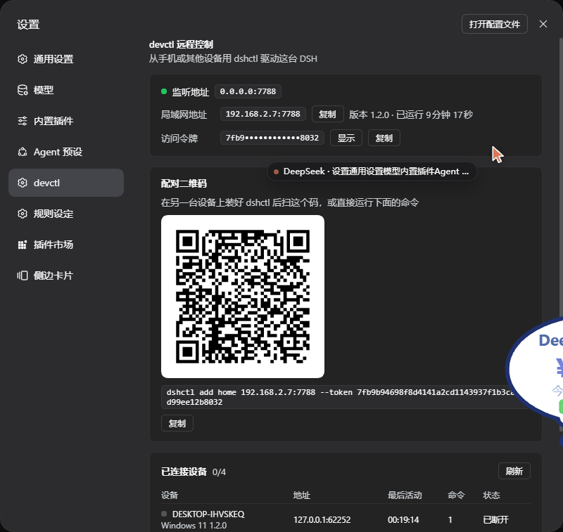

# devctl-dsh

devctl 家族的 DSH 接入层：**从另一台设备用 CLI 控制这台机器上跑着的 DSH。**

devctl 管的是设备本身（Android / Windows 的壳层、文件、日志）；devctl-dsh 管的是 **DSH 会话**——列会话、发消息、看流式回复、打断、换模型。
被控端是一个 DSH Host 插件，在 DSH 进程内开一个 token 鉴权的 JSON-Lines TCP 端口；控制端是 `cli/dshctl.py`，单文件、零依赖的 Python 3 脚本。
配对不用手抄 token——设置页里有一张二维码，手机扫一下就拿到 `dshctl add` 命令。

```
手机 / iSH / Termux / 笔记本            跑着 DSH 的机器
  dshctl.py  ────── TCP :7788 ──────►  devctl-dsh 插件 ──► sessionController
   （控制端）          JSON Lines         （被控端）        列会话 / 发消息 / 收事件
                                              ▲
                        设置页 devctl 分区 ────┘  端口 / IP / 二维码 / 设备列表
```



CLI 的参数手感对齐 `devctl`：

```bash
devctl add phone --type android --host 192.168.1.20 --token devctl
dshctl add desk  --type dsh     --host 192.168.1.10 --port 7788 --token <TOKEN>
```

`--type dsh` 已在 `dshctl` 里落地，方便 devctl 主仓库日后直接接管这条通道；本仓库不修改 devctl。

## 图形界面：Android 客户端 `dshconsole`

这个仓库里还带了一个**原生 Android 客户端**（[`clients/dshconsole/`](clients/dshconsole/)）：单 Activity、纯 Java + 手写 View、不依赖 AndroidX / Compose，产物 ~86 KB。它和 CLI 走**同一套协议、同一个配对 token**，两边可以混着用——PC 上敲命令、手机上看流式，看的是同一个会话。

- **思考块**：`✦ 思考 · N 字 ▸` 默认折叠，流式期间只在标题下露最新一行，想看全文点一下
- **模式栏**：输入框上方一排胶囊直接切 模型 / 思考强度 / 权限，不用进设置
- **两种发送**：`↑` 排队等本回合结束（本地挂起，气泡左侧标 `⏎`，回合结束自动放行）；`⏎` 立刻插话（`steer`）
- **工具调用折叠**：连续的 tool-call / tool-result 自动收成一张 `⚙ 工具调用 ×N · M 字` 卡，点标题整体展开
- **连接自愈**：断线自动重连并重新 watch，长对话不卡不抖
- **正文排版**：markdown（粗体 / 行内代码 / 标题 / 列表 / 引用）+ 真表格，规格照 Minis 的聊天界面来

构建不需要 Android SDK，Linux 沙箱里就能出包：

```bash
cd clients/dshconsole
python3 build.py        # → out/dshconsole.apk
adb install -r out/dshconsole.apk
```

更多细节（协议要点、已知边界、调试开关）见 [clients/dshconsole/README.md](clients/dshconsole/README.md)。

## 被控端：安装插件

```bash
plugin_manager install_bundle  target=<本仓库的绝对路径>
```

装完端口立即生效（profile 是 `patchReload: live`），设置页里同时出现 devctl 分区。确认：

```bash
netstat -ano | findstr :7788
```

首次启动生成 token 并写入 `%USERPROFILE%\.dsh\devctl-dsh.json`：

```json
{ "token": "7fb9b946…", "host": "0.0.0.0", "port": 7788, "version": "1.2.1", "startedAt": 1790610287877 }
```

改端口 / 绑定地址：编辑本包 `cordis.patch.yml` 的 `config`，或在 profile 补丁层覆盖同一 `id`。

### 设置页

DSH 设置里会多出一个 **devctl** 分区（在「Agent 预设」和「规则设定」之间），三张卡：

- **监听地址** —— 实际绑定的 `host:port`、本机局域网 IP、掩码后的访问令牌（点「显示」看全）
- **配对二维码** —— 扫码即可拿到 `dshctl add <ip>:<port> --token …`，二维码下面那行命令可以直接复制
- **已连接设备** —— 每台连过的设备一行：名字、平台、来源地址、最后活动时间、命令数、在线还是已断开，5 秒自动刷新

页面数据来自同一个 Host web 服务器上的两个只读端点，不需要走 TCP 端口，也不需要浏览器持有 token：

| 端点 | 内容 |
| --- | --- |
| `GET /devctl-dsh/status` | 端口、IP、令牌、设备列表的 JSON |
| `GET /devctl-dsh/qr.svg` | 配对二维码，`?text=` `?dark=` `?light=` 可覆盖 |

二维码是内置的纯 JS 编码器（`qr.js`，byte mode / ECC M / 版本 1–10），不依赖任何第三方包。

### 手机 / 平板直接看原版界面

`dsh web` 默认只绑 `127.0.0.1`，还要带一个 launch token——手机两样都拿不到。所以插件在局域网上另开一个窗口，鉴权用的就是配对那枚**控制令牌**，请求全部转给本机的 Host web 服务器：

```
手机浏览器 / 客户端 ──http://<本机IP>:7790/?token=<控制令牌>──► 本模块 ──► 127.0.0.1:<Host web 端口>
```

- 第一次带 `?token=` 进来会种一个 HttpOnly cookie 并 302 抹掉查询串，之后的静态资源和 WebSocket 都跟着走
- 目标端口不用配：插件拿自己的 `/devctl-dsh/status` 去探 loopback（这个端点只有 Host web 服务器会应答），探到就自动接上；探不到就返回 503 并说明原因
- `GET /__devctl-web/health?token=…` 返回 `{ok, origin, reason, addresses}`，控制端拿它决定是显示网页还是退回自己的界面
- 配置：`web.port`（默认 7790，**设 0 关闭**）、`web.target`（钉死本机网页地址，比如 `http://127.0.0.1:3081`）
- 自测：`node test-remote-web.mjs`（假一个 Host web 服务器，跑通发现 / 鉴权 / 跳转 / 透传）

意义在于**兼容性**：设置页是 Web 客户端，每个插件都通过 client bundle 注册自己的分区，所以手机要看全，只能加载这个页面本身，而不是给每个插件再写一遍面板。

## 控制端：安装 CLI

只有一个文件。最省事的办法是在被控端临时起个 HTTP 服务，手机直接取：

```bash
cd D:\dsh\devdsh\devctl-dsh\cli
python -m http.server 7799
```

```bash
# 手机 / iSH / Termux
curl -O http://192.168.2.7:7799/dshctl.py
python3 dshctl.py add desk --host 192.168.2.7 --port 7788 --token 7fb9b946…
```

iSH 装 Python：`apk add python3`；Termux：`pkg install python`。iSH 自带的是个很旧的 Alpine 快照，得先换源才有能用的 python3——完整步骤在 [docs/ish.md](docs/ish.md)。

`add` 之后 `--token` 只在第一次需要——同机运行时能自动读 `$DSH_HOME/devctl-dsh.json`。

## 用法

```bash
dshctl.py add <name> <host:port> [--token T] [--default]   # 注册设备
dshctl.py devices                                          # 列出设备
dshctl.py use <name>                                       # 设默认设备
dshctl.py rm <name>                                        # 删除设备

dshctl.py ping                     # 连通性 + 鉴权 + 延迟
dshctl.py peers                    # 哪些设备连过这台机器，现在还在不在

dshctl.py workspaces               # 列出工作区（别名 ws）
dshctl.py ws-new D:\proj\thing     # 把目录注册成工作区
dshctl.py ws-use d431cc0a          # 选定工作区，之后 new 默认建在这里
dshctl.py ws-rename d431cc0a "报价系统"
dshctl.py ws-rm d431cc0a           # 只摘掉注册，目录与会话都留着

dshctl.py sessions [-n 25]         # 列出会话（--roots 只留顶层，-n 0 列全部）
dshctl.py new [--workspace W] [--cwd P] [--preset N]
dshctl.py send "跑一遍测试并修掉失败"     # 发消息，流式打印回复
dshctl.py send "这张图什么颜色？" --image shot.png   # --image 可重复
dshctl.py permissions              # 看会话当前权限 + 可用预设（别名 perm）
dshctl.py permissions workspace-write
dshctl.py tail [-n 40]             # 最近的消息
dshctl.py watch [--for 60]         # 实时事件流，Ctrl-C 停止
dshctl.py cancel                   # 打断正在跑的那一轮
dshctl.py rename "新标题"
dshctl.py search "关键词"
dshctl.py models                   # 模型目录
dshctl.py models --select provider/model [--effort high]
```

全局选项可放在命令前后任意位置：`--device NAME`、`--json`、`--timeout SEC`。

会话用完整 id 或不歧义前缀指名——`sessions` 里显示的 `4863366b…bbe4` 可以直接粘回去：

```bash
dshctl send -s 4863366b "继续"
```

不给 `-s` 时用上次用过的会话，没有记忆则取最近活跃的那个。
`ws-use` 选中的工作区同理记在控制端本地，`new` 不带 `--workspace` 时就用它；若那个工作区在别处被删掉，`new` 会自动忘掉它并以默认工作区重试一次。

常用组合：

```bash
dshctl --json sessions | jq '.result.items[0].sessionId'
echo "解释这个报错" | dshctl send -
dshctl send --no-wait "长任务，后台跑着" && dshctl watch
dshctl send --steer "停，换成方案 B"
dshctl send "比对这两张设计稿" --image before.png --image after.png
```

### 工作区

工作区的增删改查走 Host 的 `workspaceController`。`ws-rm` 与 Web 端一致——**只注销工作区条目**，磁盘上的目录和该工作区下的会话都保留。

```bash
dshctl ws-new /root/repo            # 幂等：已注册就返回既有的那条
dshctl ws-rename d431cc0a 报价系统
dshctl workspaces --json | jq -r '.result.items[].path'
```

工作区可以用完整 id、id 前缀或不重名的标题来指名，`--json` 里字段是 `workspaceId`。

### 权限

`permissions` 不带参数时只从会话的权限投影里读当前值——**不唤醒冷会话**：

```bash
dshctl perm                       # current / 可用预设 / 默认预设
dshctl perm -s 4863366b
```

带预设名才会真正改写，作用于目标会话：

```bash
dshctl perm workspace-write       # 沙箱限当前工作区，审批改回 ask
dshctl perm danger-full-access    # 放开沙箱，审批 never
```

改的是那个会话的运行时策略，和 Web 端 `/permission` 是同一份状态。远端能改权限意味着**能把自己提权到 `danger-full-access`**，见下面的安全边界。

### 图片

`--image` 直接读本地文件、按扩展名定媒体类型、base64 塞进 prompt，走 DSH 的图片附件通道（`.png` `.jpg` `.jpeg` `.webp` `.gif`）。可以只发图不发字：

```bash
dshctl send --image screenshot.png      # 不写文本也合法
```

被控端读的是**控制端本机的文件**——CLI 在手机上，发的是手机里的图。

### 设备

`peers` 列的是**连过**这台机器的控制端，不是此刻的在线列表——`dshctl` 每条命令都是短连接，跑完就断，所以正常状态就是「已断开」。正在 `watch` / `tail` 的连接会显示在线；断开后记录保留 5 分钟，超过就自动清掉。

```bash
dshctl peers
dshctl peers --json | jq -r '.result.items[] | "\(.name) \(.address) \(.live)"'
```

设置页那张表的正是这份数据。设备名 / 平台 / cwd 由控制端在 `hello` 里自报，被控端只做记录。

`--json` 输出恒为 `{"ok":true,"result":…}` 或 `{"ok":false,"error":{"code","message"}}`，退出码 0/1，适合塞进脚本或交给 agent。

`send` 默认只把回复正文写到 stdout（进度提示走 stderr）；加 `--detail` 才会带上你自己的 prompt、DSH 注入的 runtime context 和 turn 边界。

## 协议

JSON Lines over TCP，请求与响应按 `id` 配对，事件不请自来。

```jsonc
// 鉴权（必须是第一条；失败即断开）；device 是控制端自报的身份，只用于设备列表
{"id":1,"method":"hello","params":{"token":"…","client":"dshctl/1.2.1","device":{"name":"phone","platform":"Darwin 24.0","version":"1.2.1","cwd":"/root"}}}

// 请求 → 响应
{"id":2,"method":"sessions.prompt","params":{"sessionId":"…","mode":"queue","text":"…","images":[{"mediaType":"image/png","data":"<base64>","name":"shot.png"}]}}
{"id":2,"ok":true,"result":{"accepted":true}}

// 事件推送
{"evt":"snapshot","data":{"sessionId":"…","cursor":282,"records":[…]}}
{"evt":"event","data":{"kind":"tool-call","name":"pwsh","arguments":"…"}}
{"evt":"delta","data":{"sessionId":"…","text":"正在"}}
```

方法：`ping`、`peers.list`、`sessions.list|create|prompt|cancel|rename|search|tail|watch|unwatch`、`workspaces.list|create|rename|delete`、`permissions.catalog|current|set`、`models.catalog|select`。

`workspaces.list` 是靠订阅 `workspaceController.follow` 拿首帧 baseline 实现的（Host 只暴露流式接口）；`permissions.set` 与 `permissions.current` 需要会话对象，被控端经 `sessionController.resolveAgent` 取，因此**对冷会话会触发一次 resume**——不带预设的 `permissions` 命令走投影，绕开这一点。

`send` 的实现顺序是**先挂 watch 再 prompt**，两者之间到达的事件一条不丢，`turn/end` 用于判断本轮结束。

在本机这类关了 session-query 索引的部署上，`sessions.search` 返回 `search-disabled`；CLI 会提示改用 `sessions` + `tail`。

## 改代码

profile 补丁层给 `dsh-hmr` 扩了监视根，插件源码目录纳入热重载：

```yaml
# %USERPROFILE%\.dsh\profiles\desktop\cordis.patch.yml
- id: hmr
  name: "@deepseek-ai/dsh-hmr"
  config:
    root:
      - "."
      - "D:/dsh/devdsh/devctl-dsh"
```

没有这层时，`dsh-hmr` 的 `baseDir` 落在 DSH 安装目录（`ctx.baseUrl`），而插件源码在 `D:\dsh\devdsh` 下——写文件不触发重载，`disable`/`enable` 和重装 bundle 也不清 ESM 缓存，改动静默失效。加上之后存盘即重载：`dshctl ping` 的 `uptime` 归零、`version` 跟着变。删掉那几行即可恢复默认。

客户端那半（`client.js`）走 DSH 自己的 bundle 图：HMR 轮询它的文件时间戳，变了就推送新 rev 给浏览器。**但有一个例外**——DSH 把「这个包是不是客户端包」的判定按 loader 行缓存到进程重启为止，所以给一个**已经在跑的** DSH 首次加上 `dsh.client` 声明时，那个否定的旧判定会让 `client.js` 一直不进图。`index.js` 里的 `refreshClientBundleGraph` 就处理这一件事：清掉这条判定并让图重新协调本包。全新启动的 DSH 上它是空操作。

## 无 UI 的机器

被控端没有桌面环境（服务器、容器、小主机）时照常跑，但要显式关掉浏览器、选对 profile：

```bash
dsh --profile remote --from-default-profile web --dump-config   # 从一个自带模板建 profile
dsh --profile remote --port 3081 --host 0.0.0.0 --no-open       # 起服务
```

`--no-open` 是给没有浏览器的机器用的；`dsh web` 会把 launch token 直接打在 stdout：

```
dsh web: http://127.0.0.1:3081/?token=…
```

那个 token 是给**浏览器**用的。它和 TCP 端口那两个鉴权各走各的路——但 profile 共用同一个状态文件 `$DSH_HOME/devctl-dsh.json`，所以桌面端和 remote profile 上的 `dshctl` 用的是同一个 token。

**`--profile headless` 不行**：那个 bundle 里没有 Host、没有 `sessionController`，本插件不会被激活。要的是带 `dsh-web-app` 的 profile。

在缺 native 模块的架构上（iOS 的 iSH 就是这种：x86 Alpine，既没有 `linux-ia32` 也没有 musl 的预编译包），`dsh` 需要显式带上 `--expose-internals`——DSH 自带的 `node-addon-require-builtin` 那两个 `require` 都被 try/catch 吞掉，落到「no-internals path」时要靠这个 flag 顶住 HMR，否则启动会中止在 `--expose-internals is required for HMR service`。依赖树里另外三个原生包（`koffi` / `node-pty` / `sharp`）是硬依赖，没有纯 JS 回退，细节见 [docs/ish.md](docs/ish.md)。

## 安全边界

- **token 等于整台机器的控制权。** 它能列出、创建、驱动本机上的任意会话，等于让远端以本机身份执行任务。
- **设置页的二维码里就写着 token。** 截图、投屏、共享屏幕时注意——那是完整的控制凭据，不是一串无意义的配对码。
- **网页窗口等于把整个 DSH 界面开到局域网。** 它和控制端口共用同一枚令牌，拿到令牌就能从手机里点完整界面（包括改模型、放权限预设）。不需要时把 `web.port` 设成 `0`。
- **权限预设也能被远端改写。** `dshctl perm danger-full-access` 会放开目标会话的沙箱、把审批设成 never——控制端不必再向本机要一次同意。
- **只在内网或 VPN 里跑。** 不要做任何公网端口映射；`0.0.0.0` 监听意味着同网段任何设备都能尝试连接——唯一阻碍就是这个 token。
- 明文传输，没有 TLS。同网段嗅探可以拿到 token。
- 换 token：停掉插件、删掉 `%USERPROFILE%\.dsh\devctl-dsh.json`、重新启用插件，然后在控制端重新 `add`。
- 不需要时把插件整个停掉，或把 `cordis.patch.yml` 里的 `host` 改成 `127.0.0.1`。
- Windows 防火墙默认拦入站，需要显式放行（管理员 PowerShell）：

```powershell
New-NetFirewallRule -DisplayName "devctl-dsh" -Direction Inbound -Protocol TCP `
  -LocalPort 7788 -RemoteAddress LocalSubnet -Action Allow
```

`-RemoteAddress LocalSubnet` 把来源限制在同网段；要更紧就限定具体网段或改用 VPN 地址。

## 文件

| 路径 | 说明 |
| --- | --- |
| `index.js` | 被控端插件：TCP 监听、token 鉴权、事件推送、设置页端点 |
| `remote-web.js` | 给已配对设备用的局域网网页窗口（反向代理 + 发现 + 鉴权） |
| `client.js` | 设置页的 devctl 分区（端口 / IP / 二维码 / 设备表） |
| `qr.js` | 纯 JS 二维码编码器，无依赖 |
| `cli/dshctl.py` | 控制端 CLI，单文件零依赖 |
| `docs/ish.md` | iSH / 纯命令行环境：安装、配对、无 UI 部署、排查 |
| `docs/settings.png` | README 顶部的设置页截图 |
| `cordis.patch.yml` | 加载器补丁：`host` / `port` |
| `package.json` | bundle 清单 |

## License

MIT © menghuanshiguang
